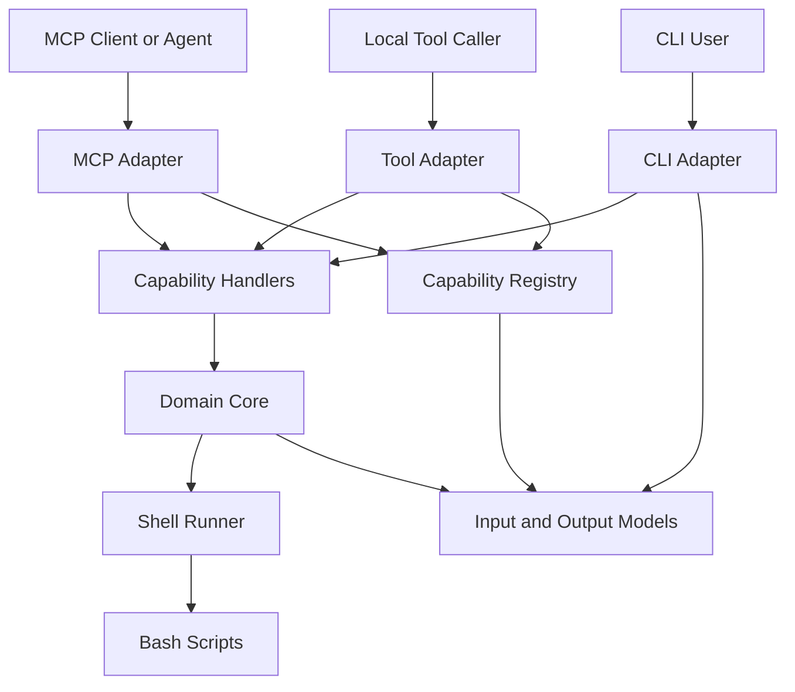
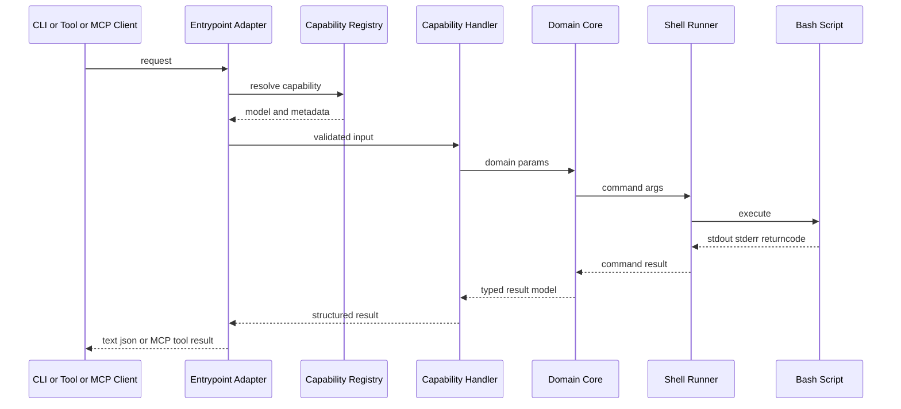

# Multi-Entrypoint Architecture

## 目标

`bootstrap` 的目标不是分别维护一套 `CLI`、一套 `Tools`、一套 `MCP` 逻辑，而是让三种入口共享同一套底层能力。

这份文档描述的是一个稳定的跨领域架构原则：

- 不同入口可以并存
- 输入输出契约尽量统一
- 业务逻辑只写一份
- shell 与协议都放在边界层

## 架构总览

## 分层说明

### 1. Entrypoint Layer

这一层只负责接入方式，不负责真正的业务实现。

包含：

- `CLI Adapter`
- `Tool Adapter`
- `MCP Adapter`

职责：

- 接收不同来源的请求
- 将请求参数映射为统一模型
- 调用统一 handler 或 core
- 把结果转换为对应入口需要的输出格式

不负责：

- 拼 shell 命令
- 解析 shell 输出细节
- 定义业务规则

### 2. Capability Layer

这一层负责把“一个能力”定义清楚，并暴露给不同入口复用。

包含：

- `Capability Registry`
- `Capability Handlers`

职责：

- 声明 canonical capability 名称
- 绑定输入模型、输出模型、风险元数据
- 负责 capability 到 core 函数的路由

这里是未来 `Tools` 与 `MCP` 的自然汇合点。

### 3. Domain Core Layer

这一层是唯一业务执行层。

例如：

- `pgsql backup`
- `pgsql restore`
- `pgsql list_backups`

职责：

- 接收已经校验好的输入模型
- 编排执行参数
- 调用 shell 边界
- 将底层返回包装成结构化领域结果

约束：

- 不关心调用方是 CLI、Tools 还是 MCP
- 不关心 stdout 最终是打印给人还是返回给 agent

### 4. Contract Layer

这一层由 Pydantic 模型组成，是整个系统的契约来源。

职责：

- 定义输入参数结构
- 定义结果结构
- 导出 JSON Schema

要求：

- CLI、Tools、MCP 都尽量复用同一套模型
- 不为不同入口维护多套重复字段定义

### 5. Execution Boundary

这一层是与外部命令和脚本交互的边界。

包含：

- shell runner
- bash scripts

职责：

- 执行 subprocess
- 收集 `returncode`、`stdout`、`stderr`
- 与既有 shell 能力兼容

约束：

- 入口层不能越过 core 直接触达 shell
- 协议层不能直接拼接 shell 参数

## 调用时序

下面这张图描述一次标准能力调用的过程。

## 模块职责映射

结合当前仓库，可以把职责理解为：

- `src/bootstrap/cli/`：CLI Adapter
- `src/bootstrap/tools/registry.py`：Capability Registry 的现有基础
- `src/bootstrap/tools/handlers/`：建议新增，承接 capability handler
- `src/bootstrap/mcp/`：建议新增，承接 MCP Adapter
- `src/bootstrap/core/`：Domain Core
- `src/bootstrap/models/`：Contract Layer
- `src/bootstrap/utils/shell.py`：Execution Boundary
- `services/`、`platforms/`、`observability/` 下的 shell 脚本：底层执行脚本

## 设计模式

这套架构没有刻意追求复杂模式，但确实采用了几种很明确的设计思路。

### Adapter Pattern

`CLI`、`Tools`、`MCP` 都是适配器。

它们的作用不是实现业务，而是把不同交互方式转换成统一调用链。  
这是整个架构里最核心的模式。

### Registry Pattern

Capability 通过注册表集中声明。

好处：

- 名称统一
- schema 可发现
- metadata 可集中管理
- `Tools` 和 `MCP` 可以共享 discover 机制

### Command or Use-Case Style

每个能力都表现为一个清晰的动作入口，例如：

- `backup`
- `restore`
- `list_backups`

每个入口都接收明确输入，返回明确结果，天然适合 CLI、Tools、MCP 三端复用。

### Schema-First Contract Design

输入输出模型先稳定下来，入口层再围绕模型做适配。

这不是传统 GoF 模式，但对于 agent-friendly 系统非常重要，因为：

- schema 能自动导出
- 参数语义一致
- 不同入口不容易漂移

### Lightweight Ports and Adapters

整体风格接近轻量版的 Ports and Adapters：

- 外侧是多入口适配器
- 中间是稳定业务核心
- 内外通过模型与 handler 解耦
- shell/script 被看作外部执行端口

这里是“思路接近”，不是严格教科书式六边形实现。

## 为什么不采用更重的模式

当前阶段不适合引入太重的抽象，例如：

- 完整事件总线
- 复杂插件容器
- 过度细分的工厂体系
- DDD 风格的聚合与仓储体系

原因很简单：

- 当前问题是统一入口，不是解决超复杂领域建模
- 现有能力很多仍然基于 shell，过重抽象会拖慢落地
- 第一阶段更需要“边界清晰”，而不是“抽象繁复”

## 稳定约束

这套架构建议长期保持以下约束：

1. 业务逻辑只进入 `core`
2. 契约只进入 `models`
3. 入口层不得直接操作 shell
4. 新入口优先复用 capability registry 与 handlers
5. 输出尽量复用同一批 result models
6. capability 名称统一使用 canonical namespaced 格式

## 与演进文档的关系

这份文档描述的是稳定架构原则。

更偏阶段性推进、实现顺序、第一版范围取舍的内容，继续放在：

- `docs/plans/active/mcp-evolution.md`

也就是说：

- `docs/architecture/multi-entrypoint-architecture.md`：回答“整体怎么分层”
- `docs/plans/active/mcp-evolution.md`：回答“第一版先做什么”
