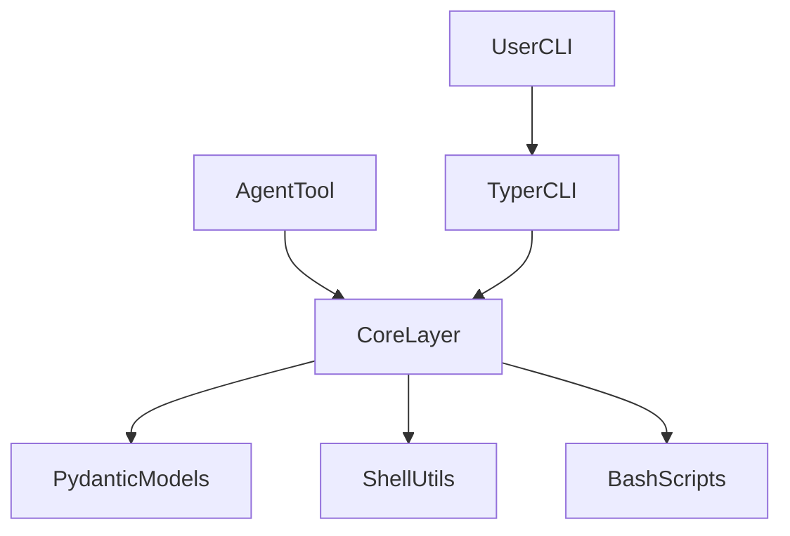

# Bootstrap CLI Refactor Design

## 目标

`bootstrap` 已经从“根目录平铺 Bash 脚本”收敛到按领域组织的最终结构：

- `platforms/`：平台能力
- `services/`：服务能力
- `observability/`：可观测性能力
- `src/bootstrap/`：Python CLI / Core / Models / Tools

本设计文档描述当前最终态，而不是迁移期方案。

## 最终目录结构

```text
bootstrap/
├── install.sh
├── common/
│   └── lib.sh
├── platforms/
│   └── k8s/
│       ├── kubeadm/
│       │   └── install.sh
│       └── kind/
│           └── install.sh
├── services/
│   └── pgsql/
│       ├── backup/run.sh
│       ├── restore/run.sh
│       └── tests/
├── observability/
│   └── prometheus/
│       └── install.sh
├── src/
│   └── bootstrap/
│       ├── cli/
│       ├── core/
│       ├── models/
│       ├── tools/
│       └── utils/
├── tests/
│   └── unit/
└── docs/
```

## 命名原则

- 对外命令只保留 canonical 命名
- CLI 子命令与 Python 包结构保持一致
- Tool 名称统一使用 namespaced 风格
- 不再保留旧目录 wrapper、短别名和下划线 Tool 名称

## CLI 结构

```text
bootstrap
├── pgsql
│   ├── backup
│   ├── restore
│   └── list-backups
├── k8s
│   ├── kubeadm
│   │   ├── init
│   │   ├── join
│   │   ├── label-workers
│   │   └── dashboard
│   └── kind
│       ├── create
│       ├── install
│       ├── delete
│       └── status
├── tools
│   ├── list
│   └── schema
└── version
```

示例：

```bash
bootstrap pgsql backup -d mydb --yes
bootstrap pgsql restore mydb.dump -d mydb_new --yes

bootstrap k8s kubeadm init --yes
bootstrap k8s kubeadm join
bootstrap k8s kind create --name dev --yes

bootstrap tools schema pgsql.backup
```

## Tool 结构

Tool 名称统一如下：

- `pgsql.backup`
- `pgsql.restore`
- `pgsql.list_backups`
- `k8s.kubeadm.init`
- `k8s.kubeadm.join`
- `k8s.kubeadm.dashboard`
- `k8s.kind.create`
- `k8s.kind.install`
- `k8s.kind.delete`
- `k8s.kind.status`

## 分层说明



约束：

- `cli` 只依赖 `core`、`models`
- `tools` 只暴露 canonical schema 与调用入口
- `core` 不依赖 `cli`
- `models` 只定义输入输出

## 根入口分发

根 `install.sh` 只负责远程分发到真实脚本：

- `k8s -> platforms/k8s/kubeadm/install.sh`
- `kind -> platforms/k8s/kind/install.sh`
- `prometheus -> observability/prometheus/install.sh`

## 当前实现状态

- `pgsql`：Bash 脚本 + Python Core/CLI 已打通
- `kubeadm`：Bash 脚本 + Python Core/CLI 已打通
- `kind`：Bash 脚本 + Python Core/CLI 已打通
- `prometheus`：当前仍以 Bash 入口为主

## 测试策略

### Python

```bash
uv run pytest tests/unit -v
```

### PostgreSQL Bash

```bash
bash services/pgsql/tests/test_pgsql.sh
bash services/pgsql/tests/test_integration.sh
```

`test_integration.sh` 使用：

- `pg-source:5434`
- `pg-target:5433`
- 真实 `pg_dump`、`pg_restore`、`psql`

## 非目标

- 不再维护迁移期兼容路径
- 不再维护 CLI 短别名
- 不再维护 Tool 下划线别名
