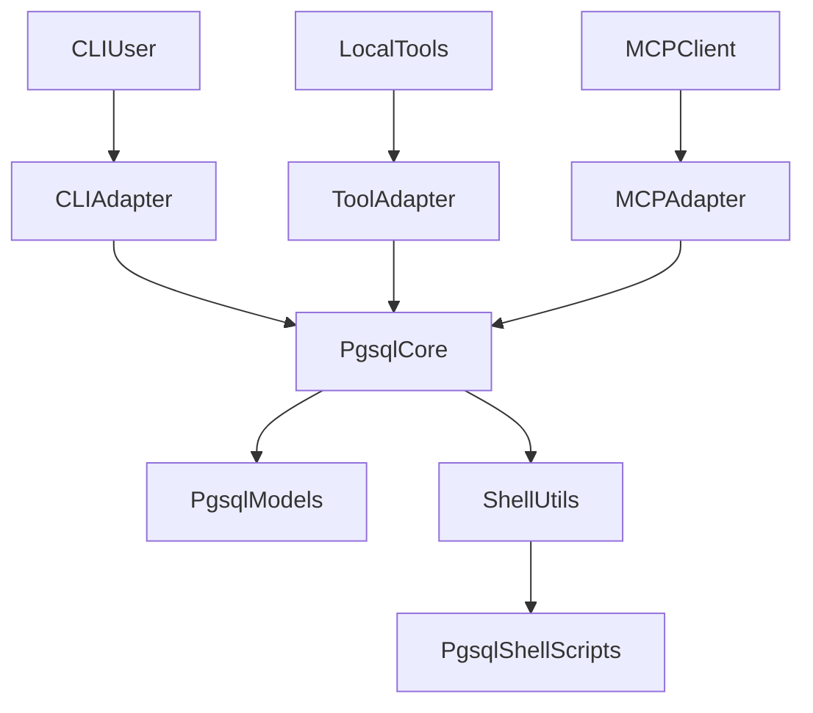

# MCP Evolution

## 目标

第一版只围绕 `pgsql` 设计一个可以快速落地的 MCP 方案，并把它作为未来统一入口形态的模板。

最终目标不是先做很多功能，而是先确保：

- `CLI`
- `Tools`
- `MCP`

三种入口都复用同一套底层代码，不出现三套业务逻辑。

## 当前基础

`bootstrap` 已经具备一批适合继续向 MCP 演进的前提：

- `src/bootstrap/models/services/pgsql.py` 已定义 `PgsqlBackupParams`、`PgsqlRestoreParams`、`PgsqlListBackupsParams`
- `src/bootstrap/models/services/pgsql.py` 已定义 `PgsqlBackupResult`、`PgsqlRestoreResult`、`PgsqlBackupFile`
- `src/bootstrap/core/services/pgsql.py` 已将 shell 执行结果封装成结构化返回
- `src/bootstrap/tools/registry.py` 已有 canonical tool 名与 Pydantic 模型映射
- `src/bootstrap/cli/services/pgsql.py` 已可输出文本和 JSON

这意味着第一版不需要重新设计一套业务核心，只需要增加一层 MCP 适配。

## 核心原则

### 单一业务核心

所有 `pgsql` 能力都应收敛到同一层：

- 入参模型：`src/bootstrap/models/services/pgsql.py`
- 执行逻辑：`src/bootstrap/core/services/pgsql.py`
- shell 边界：`src/bootstrap/utils/shell.py`

约束如下：

- CLI 不直接写业务逻辑
- Tools 不直接写业务逻辑
- MCP 不直接写业务逻辑
- 三者都只是适配层

### 三种入口职责划分

- `CLI`：面向人类终端，负责参数解析、文本输出、退出码
- `Tools`：面向本地程序化调用，负责 schema 暴露和 handler 映射
- `MCP`：面向外部 Agent/Client，负责协议对接、tool discover、tool invoke
- `Core`：唯一业务执行层
- `Models`：唯一输入输出契约来源
- `Shell`：唯一 subprocess 边界

## 第一版范围

第一版只覆盖 3 个 `pgsql` tool：

- `pgsql.backup`
- `pgsql.restore`
- `pgsql.list_backups`

选择这三个能力的原因：

- 已经有 canonical 命名
- 已经有 Pydantic 入参模型
- 已经有 Core 返回结构
- 已经有 CLI 和测试基础

## 协议与规范

### 1. Tool 命名规范

第一版只允许 canonical namespaced 命名：

- `pgsql.backup`
- `pgsql.restore`
- `pgsql.list_backups`

不要再定义：

- `pgsql_backup`
- `backup_pgsql`
- `pgsql.backup.v1`

### 2. 输入协议规范

MCP、Tools、CLI 最终都从同一套 Pydantic 输入模型出发：

- `PgsqlBackupParams`
- `PgsqlRestoreParams`
- `PgsqlListBackupsParams`

这意味着：

- `registry.py` 负责把模型导出为 JSON Schema
- CLI 参数只是这些模型字段的人类友好映射
- MCP 输入直接采用这些字段

第一版应保持字段命名与模型完全一致，不额外定义一套 MCP 专属输入命名。

### 3. 输出协议规范

第一版 MCP 输出直接复用现有 Core 返回结构，不额外设计第二套响应模型。

也就是：

- `PgsqlBackupResult`
- `PgsqlRestoreResult`
- `list[PgsqlBackupFile]`

统一要求输出包含：

- `success`
- `returncode`
- `summary`
- `stdout`
- `stderr`
- `next_actions`
- 领域字段，例如 `database`、`backup_file`

这样可以保证：

- CLI 的 `--output json`
- 本地 Tools 调用
- MCP tool result

三者结果形状尽量一致。

### 4. 错误规范

第一版只分两层错误：

1. 业务执行失败  
   返回结构化结果，`success=false`，并保留：
   - `returncode`
   - `stdout`
   - `stderr`
   - `summary`

2. 协议级错误  
   仅用于：
   - 未知 tool 名
   - 输入参数无法通过 schema 校验
   - 请求结构不合法

第一版不引入更复杂的错误协议，以便快速落地。

### 5. Tool annotations 规范

基于 MCP 官方规范，第一版建议显式提供 tool annotations，避免客户端按悲观默认值处理。

建议默认值如下：

| Tool | readOnlyHint | destructiveHint | idempotentHint | openWorldHint |
|------|--------------|-----------------|----------------|---------------|
| `pgsql.list_backups` | true | false | true | false |
| `pgsql.backup` | false | false | false | false |
| `pgsql.restore` | false | true | false | false |

说明：

- 这些注解是 hint，不是安全边界
- `pgsql.restore` 默认按 destructive 处理
- 第一版仍需在设计层保留人工确认/策略钩子的扩展位置

## 风险分级与默认策略

即使只做 `pgsql`，也应先定义风险等级：

- `pgsql.list_backups`：低风险，只读
- `pgsql.backup`：中风险，创建备份文件
- `pgsql.restore`：高风险，可能覆盖目标数据库

附加约束：

- `restore` 默认视为高风险 tool
- 如果 `clean=true`，风险进一步升高
- 第一版设计中先写清默认策略，不急着实现复杂权限系统

建议的默认策略：

| Tool | 风险等级 | 默认策略 |
|------|----------|----------|
| `pgsql.list_backups` | low | 默认可直接调用 |
| `pgsql.backup` | medium | 默认可调用，但保留执行摘要与 next actions |
| `pgsql.restore` | high | 文档中明确为高风险操作，后续在 MCP adapter 层加确认 hook |

## 运行形态建议

### Transport

第一版建议优先采用 `stdio`：

- 实现最简单
- 最适合本地快速开发与调试
- 更符合你当前“先做一个非常快速的 MCP”的目标

`Streamable HTTP` 暂不作为第一版目标，后续如果需要远程部署再评估。

### 能力范围

第一版只做 `tools`，暂不引入：

- `resources`
- `prompts`

原因：

- `pgsql` 当前最成熟的是“调用能力”，不是“只读上下文资源”
- `tools` 已足够覆盖你当前想要的统一入口目标
- `resources/prompts` 会增加协议和产品面复杂度，不利于快速落地

### 第一版暂不强做的协议能力

为了快速落地，第一版先不把以下能力作为必须项：

- progress reporting
- cancellation
- session 管理抽象
- 复杂 auth / policy 系统

这些并非不重要，而是优先级低于“统一底层模型与执行链路”。

## 代码结构建议

第一版不重做仓库结构，只补最薄的一层 MCP 适配。

### 已有可复用层

- `src/bootstrap/models/services/pgsql.py`
- `src/bootstrap/core/services/pgsql.py`
- `src/bootstrap/tools/registry.py`
- `src/bootstrap/cli/services/pgsql.py`

### 建议新增的职责层

设计上建议在 `src/bootstrap/tools/` 里补出真正的 handler 概念，而不是只保留 registry。

职责建议：

- `registry.py`：tool name -> input model / schema / annotations
- `handlers`：tool name -> core function 调用
- `mcp adapter`：把 MCP 请求映射到 handler

关键原则：

**MCP 不直接调用 shell，不直接解析 stdout，不直接拼命令参数。**

这些都继续归 `core` 负责。

## 推荐开发顺序

1. 先把本文件扩成 `pgsql MCP` 总体设计文档
2. 明确 3 个 tool 的 input/output 契约
3. 明确 `registry -> handler -> core` 的调用链
4. 明确高风险 tool 的分级和默认策略
5. 再决定是否真正引入 MCP server runtime

## 文档落点建议

当前这份设计最适合继续放在：

- `docs/plans/active/mcp-evolution.md`

因为它现在仍然是演进中的设计，而不是稳定架构说明。

等真正落地并稳定后，再沉淀一份 architecture 版文档到：

- `docs/architecture/`

## 快速实现标准

你想要的是“非常快速地开发一个 MCP”，那第一版标准应该是：

- 只支持 `pgsql`
- 只支持 3 个 canonical tools
- 输入 schema 直接复用 Pydantic models
- 输出直接复用 Core result models
- tool annotations 显式声明
- 只做 `tools`，不做 `resources/prompts`
- transport 先选 `stdio`
- 不做复杂权限系统

## 当前仍未展开但应预留的点

下面这些点目前不阻塞第一版设计成立，但如果后续进入实现阶段，建议尽早补齐：

- Python MCP SDK 选型与封装方式
- timeout / cancellation 如何映射到 Core 与 subprocess
- 日志、审计信息、调用追踪如何保留
- 备份目录、目标库、文件路径的安全约束
- 后续从 `stdio` 演进到 `Streamable HTTP` 时的兼容策略
- tool schema 与结果模型的版本演进策略

其中最值得优先预留的是两点：

- SDK 选型不要污染业务层，避免未来更换 SDK 时动到 `core`
- timeout / cancellation 即使第一版不做，也要避免把调用链写死

## 设计完成后的下一步

如果你确认这版设计方向没问题，下一步最自然的是：

- 再补一份实现计划，例如 `docs/plans/active/pgsql-mcp-implementation.md`
- 然后进入实际编码
- 落地稳定后，再沉淀一份 architecture 版文档
